## はじめに

次のgatsby-starterを利用して爆速ポートフォリオ作りを行いたいと思います。

- [gatsby-starter-portfolio-cara](https://www.gatsbyjs.org/starters/LekoArts/gatsby-starter-portfolio-cara/)

## そもそもGatsbyとは

React用の静的サイトジェネレーターとなります。  
これがまた素晴らしいものでGitHubPageなどで手軽に高速なサイトを構築することができます。  

Gatsbyは公式サイトの日本語ドキュメントも充実しており、チュートリアルを行うことでどんなことができるのか一通り理解することができると思います。  
[Gatsby.jsドキュメント](https://www.gatsbyjs.org/docs/)

特にReactをやりたい！場合は、Reactでカスタマイズを行えば、比較的なんでもできます。  
構築自体は簡単なので、いろいろチャレンジしてみてください！

--- 

## どんな時にGatsbyを使うのか

Reactでアプリケーションを作る時に主に利用されるのが次の３パターンかと思います。  
結局のところなんでもそれとなく作れてしまうところでもあります。  
好み的な要素は大きいかと．．．  

- CRA(Create React App)
- Next.js
- Gatsby

簡単な違いをさらっとだけご紹介します。

### CRA(Create React App)

Reactを初めましての方は、まずはこちらから触ってみるのではないでしょうか。  
主な用途としては、クライアントサイドでゴリゴリレンダリングするSPAとしてサイトが構築されます。  
なんでもそつなく対応できます。  
パフォーマンスがいいわけではないため、入門として始めるには良いと思います。  

**用途**
- 雑に言えば、なんでもOK

### Next.js

サーバーサイドレンダリング(SSR)でサーバー側でHTMLを生成してあげる強者です。  
結構クセがあり、CRAでは上手く行ってたのに、Next.jsでは動かない...という悲しいお話も聞きます。  
データ更新などが多い場合、クライアント側に負荷をかけることは少ないので、ユーザー的にはCRAよかいいのかなと。  
SSRにする際に気にされることとしてはSEOを意識してSSRを取り入れることが多い印象があります。  

**用途**
- SEOを意識するサイト
- ECサイト
- BtoC向けサイト

### Gatsby

ビルド時にHTMLを生成し、クライアントが読み込むものはHTMLファイルとなります。(生成済み)  
そのため、ユーザーは読み込み時間を意識することなく、爆速でページが表示されることとなります。  
※API通信がなければ...  
読み込みが多いサイトなどはあまり向かないかもしれません。

**用途**
- コーポレートサイト
- ブログ
- ポートフォリオ

## やってみよう

### 0. ポートフォリオに記載する内容を考えよう

今回ポートフォリオを作り出す前に、まずはどんなポートフォリオにするか皆さんの経歴を整理してください。

- お名前
- （あれば）写真
- いままでの経験スキル
- 個人的に勉強していること
- （あれば）個人サイト

### 1. gatsby-cliをインストールしよう

今回は[Katacoda](https://www.katacoda.com/)を利用して開発を進めたいと思います。  

※ 遅いのは許してください。

まずは次のURLよりKatacodaのnodejs環境にアクセスしてください。  
https://www.katacoda.com/courses/nodejs/playground  
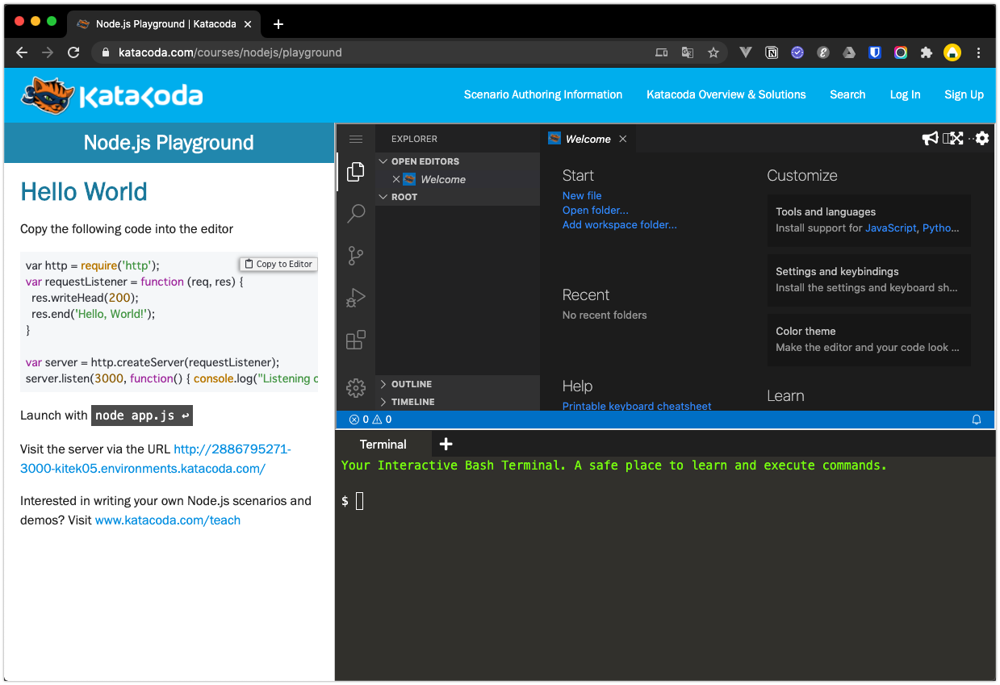

以下のコマンドを実行して、gatsbyコマンドを使用できるようにしてください。  
gatsbyコマンドをインストールするので少々お待ちください。

```
npm install -g gatsby-cli
```

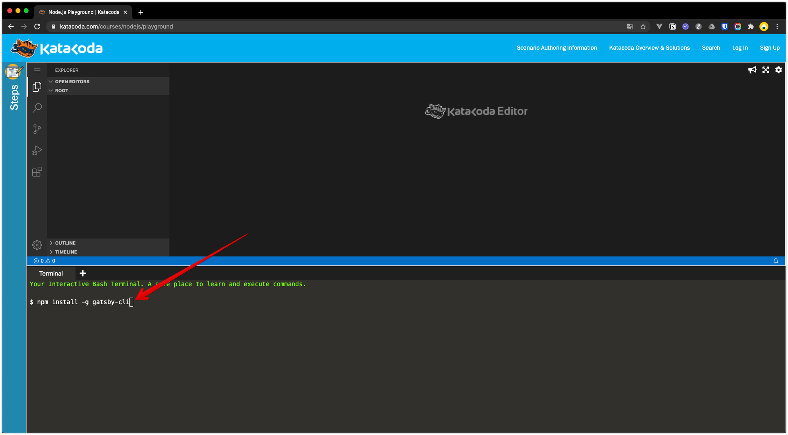
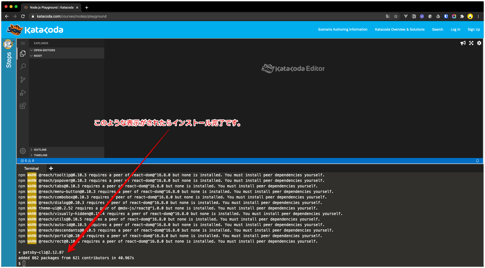

### 2. gatsby-starterでテンプレートサイトを作成しよう

以下のコマンドを実行して、[gatsby-starter-portfolio-cara](https://www.gatsbyjs.org/starters/LekoArts/gatsby-starter-portfolio-cara/)のテンプレートサイトを作成します。

```
gatsby new portfolio https://github.com/LekoArts/gatsby-starter-portfolio-cara
```

次のような表示になりまたら、インストール完了です。


### 3. 開発サーバーを起動しよう

それでは、portfolioサイトを作成しましたので、
以下のコマンドを実行することでgatsby開発サーバーを起動します。

```
# まずはportfolioに移動してください。
cd portfolio

# 開発サーバー起動
gatsby develop --port 3000 --host 0.0.0.0
```

開発サーバーが正常に起動されると次のような状態になります。

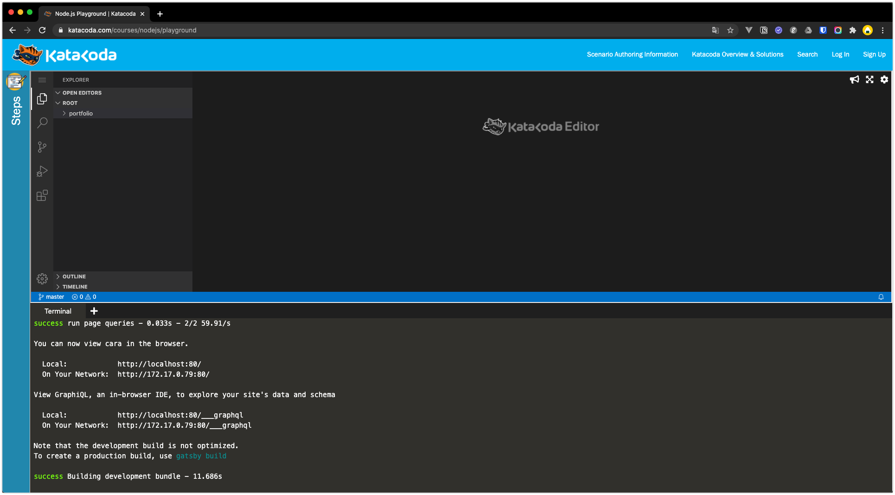

左側にあるStepsに記載してあるURLにアクセスします。


こちらでポートフォリオスターターを利用した土台準備が完了しました。
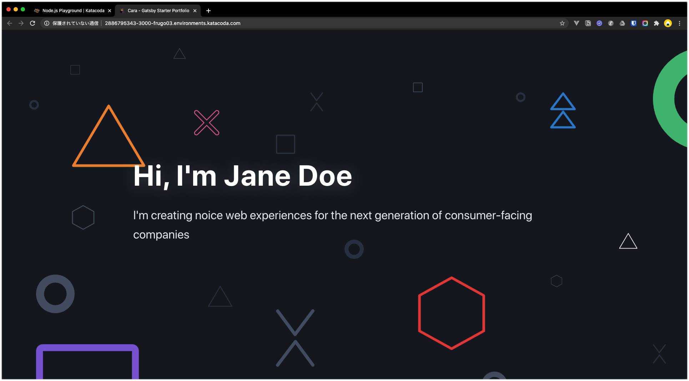

### 4. ポートフォリオで自分をアピールしよう

サンプルポートフォリオを記載していますので、そちらを参考に自分のアピール文を考えて記載してみてください。  
srcをクリックするとサンプルのintro.mdxがありますので、その他3ファイルを追加して、自己紹介文を入力してください。  

ファイルパス
```
portfolio
┗ src
  ┗ @lekoarts
    ┗ gatsby-theme-cara
      ┗ sections
        ┣ about.mdx    [表示順③　自己紹介]
        ┣ contact.mdx  [表示順④　連絡先]
        ┣ intro.mdx    [表示順①　はじめに]
        ┗ projects.mdx [表示順②　作成したポートフォリオたち紹介]
```
※1　gatsbyのテンプレート側で設定されている文言が表示されていますので、指定されたファイルを作成し、設定文言を上書きする形でポートフォリオを完成させていきます。

※2 Ctrl + c で開発サーバーを停止できます。

### 5. GitHub Pagesで公開しよう

#### GitHubアカウント作成(事前準備)

公開するにあたり事前にGitHubアカウントが必要です。  
まだお持ちではない方は作成をお願いします。  

https://github.co.jp/

#### gh-pagesインストール

gh-pagesという便利なやつをインストールします。
```
npm install gh-pages --save-dev
```

#### リポジトリ作成

GitHubでポートフォリオ用リポジトリを作成していきます。  
まずは**New**ボタンをクリックします。

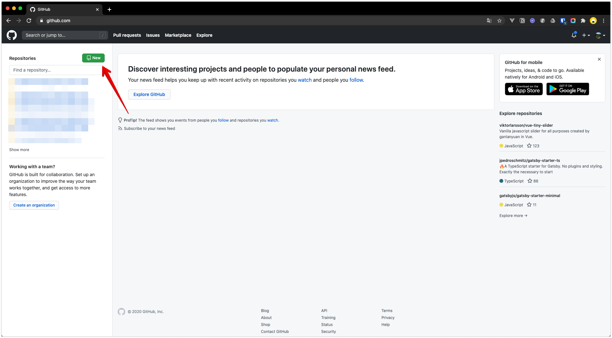

**Repository name**に適当なリポジトリ名を入力して、**Create repository**をクリックします。  
※ 基本デフォルト設定で今回行います。

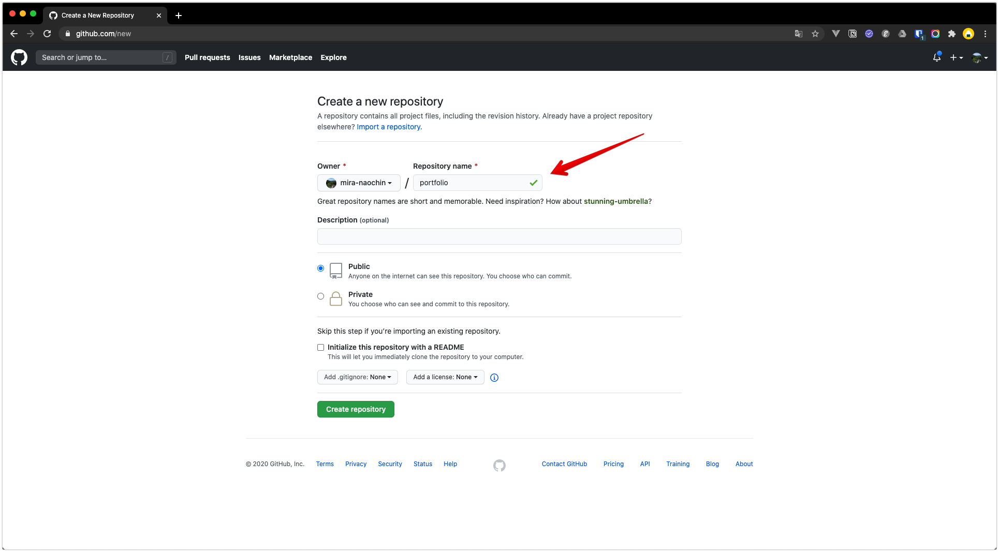

リポジトリ作成ができます。


#### gh-pages

package.jsonにデプロイ用コマンドを追記します。

```
"deploy": "gatsby build --prefix-paths && gh-pages -d public"
```

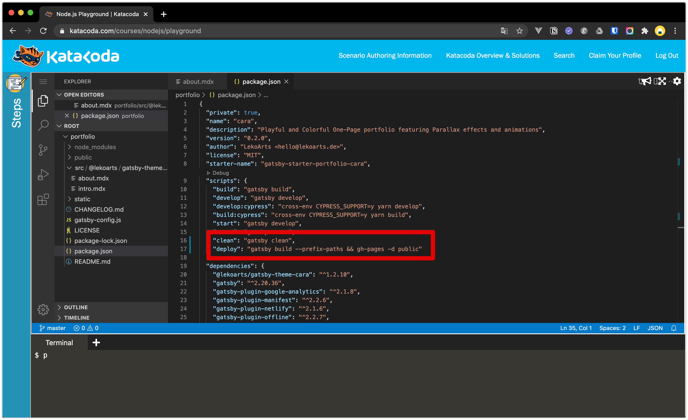
※ "clean": "gatsby clean"の後ろにカンマを忘れずに追加してください。

gatsby-config.jsに２つの設定を追加します。

```
pathPrefix: "/portfolio",
```

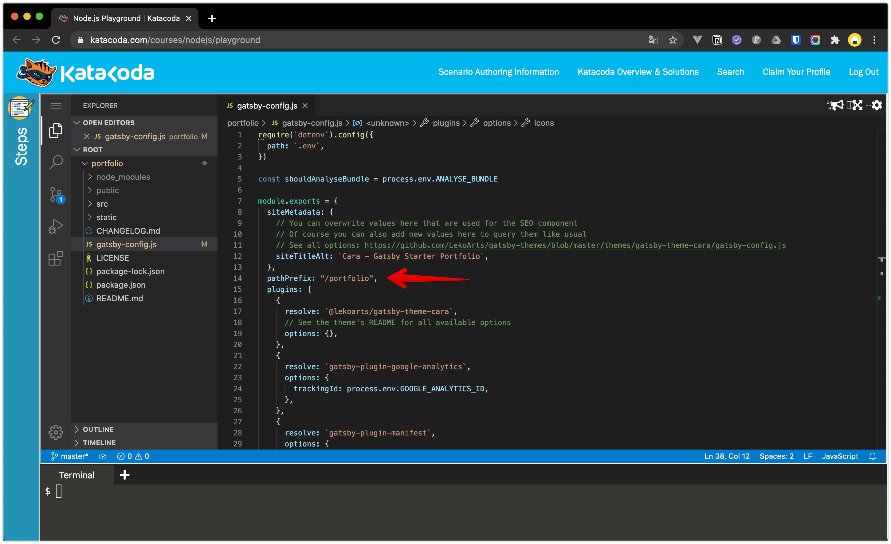


```
crossOrigin: `use-credentials`,
```

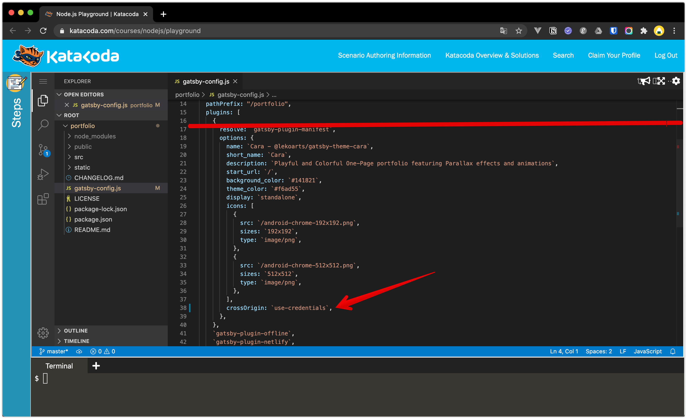

#### Gitに反映

リポジトリ作成時に表示したコマンドを実行します。

例
```
git remote add origin https://github.com/mira-naochin/portfolio.git
git push -u origin master
```

GitHub側にgatsbyが反映されていることを確認してください。


#### GitHub Pagesの確認

GitHubのリポジトリページにあるSettingsをクリックします。

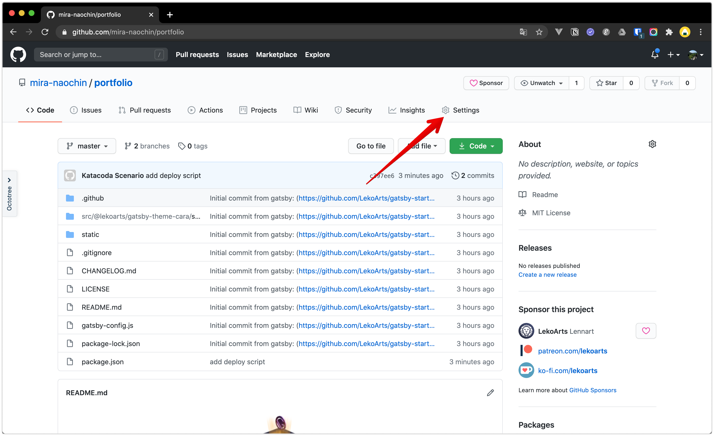

Settingsページの下部にあるGitHubPages欄にあるURLより公開されたポートフォリオが確認できます。


### 応用編

私は今回知った拡張子 .mdxですが、なんとなんとMarkdownとJSXを使えます。  
Markdownは使い慣れた方も多いかと思いますが、MDXを日常使いしている方は聞いたことないです．．..
[MDX](https://mdxjs.com/)の公式サイトより使い方を学んで、俺流ポートフォリオサイトを作成して楽しんでください！

[Gatsby Plugin Library](https://www.gatsbyjs.com/plugins/)で様々なプラグインが公開されています。  
こちらを活用することで自分オリジナルのサイトを作ることができるので、余裕がある方は模索してみてください！

### 余談

今回は大きく３つの目玉商品を利用してみました。

- [MDX](https://mdxjs.com/)
  - MarkdownとJSXを使えるイケイケなやつです。
- [gatsby-starter-portfolio-cara](https://github.com/LekoArts/gatsby-starter-portfolio-cara)
  - 今回利用したスターターサイトとなります。
- [gatsby-theme-cara](https://github.com/LekoArts/gatsby-themes/tree/master/themes/gatsby-theme-cara)
  - いい感じにサイトが動くのはこのテンプレートのおかげです。
- [gh-pages](https://github.com/tschaub/gh-pages)
  - GitHub Pagesに手軽に公開してくれるいいかんじのやつです。

