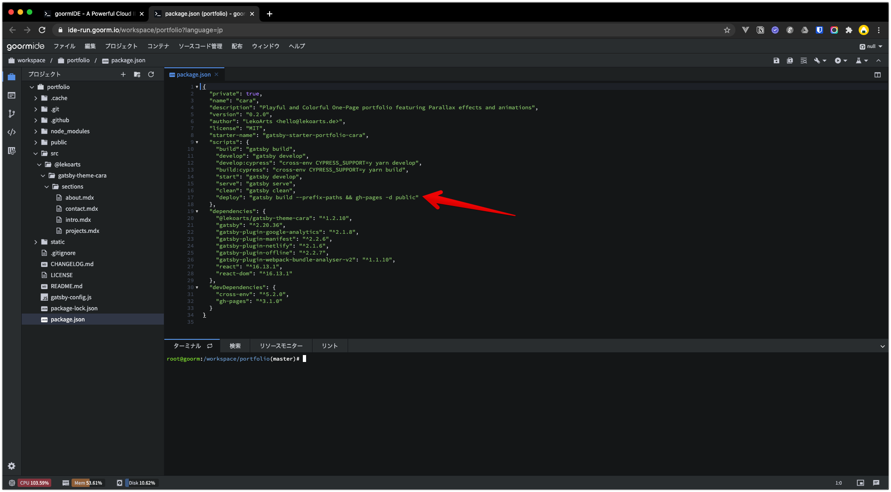
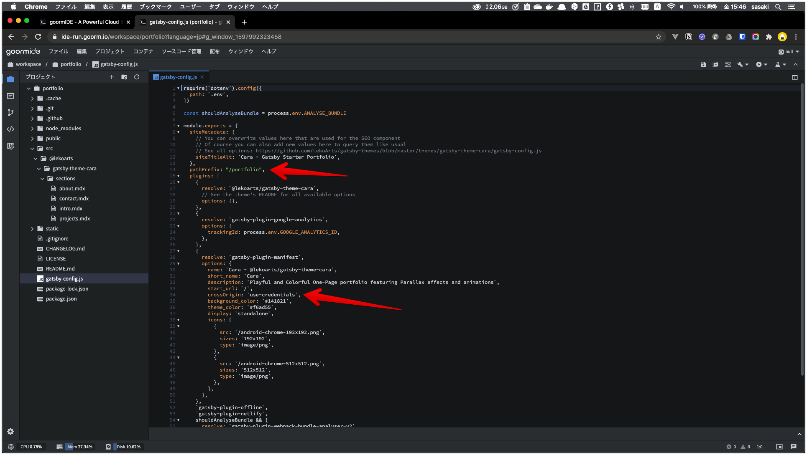

## はじめに

次のgatsby-starterを利用して爆速ポートフォリオ作りを行いたいと思います。

- [gatsby-starter-portfolio-cara](https://www.gatsbyjs.org/starters/LekoArts/gatsby-starter-portfolio-cara/)

## そもそもGatsbyとは

React用の静的サイトジェネレーターとなります。  
これがまた素晴らしいものでGitHubPageなどで手軽に高速なサイトを構築することができます。  

Gatsbyは公式サイトの日本語ドキュメントも充実しており、チュートリアルを行うことでどんなことができるのか一通り理解することができると思います。  
[Gatsby.jsドキュメント](https://www.gatsbyjs.org/docs/)

特にReactをやりたい！場合は、Reactでカスタマイズを行えば、比較的なんでもできます。  
構築自体は簡単なので、いろいろチャレンジしてみてください！

--- 

## どんな時にGatsbyを使うのか

Reactでアプリケーションを作る時に主に利用されるのが次の３パターンかと思います。  
結局のところなんでもそれとなく作れてしまうところでもあります。  
好み的な要素は大きいかと．．．  

- CRA(Create React App)
- Next.js
- Gatsby

簡単な違いをさらっとだけご紹介します。

### CRA(Create React App)

Reactを初めましての方は、まずはこちらから触ってみるのではないでしょうか。  
主な用途としては、クライアントサイドでゴリゴリレンダリングするSPAとしてサイトが構築されます。  
なんでもそつなく対応できます。  
パフォーマンスがいいわけではないため、入門として始めるには良いと思います。  

**用途**
- 雑に言えば、なんでもOK

### Next.js

サーバーサイドレンダリング(SSR)でサーバー側でHTMLを生成してあげる強者です。  
結構クセがあり、CRAでは上手く行ってたのに、Next.jsでは動かない...という悲しいお話も聞きます。  
データ更新などが多い場合、クライアント側に負荷をかけることは少ないので、ユーザー的にはCRAよかいいのかなと。  
SSRにする際に気にされることとしてはSEOを意識してSSRを取り入れることが多い印象があります。  

**用途**
- SEOを意識するサイト
- ECサイト
- BtoC向けサイト

### Gatsby

ビルド時にHTMLを生成し、クライアントが読み込むものはHTMLファイルとなります。(生成済み)  
そのため、ユーザーは読み込み時間を意識することなく、爆速でページが表示されることとなります。  
※API通信がなければ...  
読み込みが多いサイトなどはあまり向かないかもしれません。

**用途**
- コーポレートサイト
- ブログ
- ポートフォリオ

## やってみよう

### 0. ポートフォリオに記載する内容を考えよう

今回ポートフォリオを作り出す前に、まずはどんなポートフォリオにするか皆さんの経歴を整理してください。

- お名前
- （あれば）写真
- いままでの経験スキル
- 個人的に勉強していること
- （あれば）個人サイト

### 1. gatsby-cliをインストールしよう

今回は[goormIDE](https://ide.goorm.io/)を利用して開発を進めたいと思います。  

※ 遅いのは許してください。無料で利用できる範囲ですので...

次のURLより右上にある「IDEを始める」よりgoormIDEにログインしてください。  
今回はGitHubログインを行ってください  
https://ide.goorm.io/  


GitHubログインを行うと次のように連携確認画面になりますので、「Authorize goormist」をクリックしてください。  


メール登録を促されます。  
こちらは任意となりますので、メール登録してもOK、しなくてもOKです。  


ログインすると開発環境を構築するための「ダッシュボード」ボタンが表示しますので、クリックしてください。  


ダッシュボード画面でコンテナを作成し、開発環境を作成することができます。  
「新しいコンテナ作成」アイコンをクリックしてください。  


コンテナの設定を行います。  
以下の設定を行ってください。

- 名前：portfolio
- 領域：Seoul (KOR)
- 公開範囲：Public
- テンプレート：Template
- 配備：Not used
- ソフトウェアスタック：Node.js
- OS：Ubuntu 18.04 LTS
- Template：Node.js空のプロジェクト
- 追加モジュール/パッケージ：Node.jsをバージョン 12.xx にアップグレードします。

設定を行いましたら、右上の「コンテナの作成(Ctrl + M)」をクリックします。  


開発環境作成中ですので、少々お待ちください。  


次の画面が表示されると開発環境が作成完了となります。  


「コンテナの実行」ボタンをクリックして、開発環境を表示してください。  


gatsbyコマンドをインストールします。  
ターミナルに以下のコマンドを入力・実行することでgatsbyコマンドを利用することができるようになります。  

```
npm install -g gatsby-cli
```


ターミナルに「added XXX packages from XXX contributors in XXXs」が表示されたらインストール完了です。  
これでgatsbyコマンドを実行することができるようになります。  


### 2. gatsby-starterでテンプレートサイトを作成しよう

ターミナルに以下のコマンドを実行して、[gatsby-starter-portfolio-cara](https://www.gatsbyjs.org/starters/LekoArts/gatsby-starter-portfolio-cara/)のテンプレートサイトを作成します。  

```
gatsby new portfolio https://github.com/LekoArts/gatsby-starter-portfolio-cara
```

テンプレートサイトが作成されるとサイドバーに「portfolio」フォルダが作成されます。  
ここで問題が発生してしまいます。  
portfolioのフォルダの中にportfolioが作成されてしまいますので、下のコマンドでファイルを移動してください。  

```
# .tempファイル削除, 子portfolioを親portfolioにコピー, 子portfolio削除を行います。
rm .temp && cp -r . ../ && rm -rf portfolio
```

### 3. 開発サーバーを起動しよう

portfolioサイトを作成できましたので、以下のコマンドを実行することでgatsby開発サーバーを起動します。  
変更はlivereloadで反映されますが、ファイルの追加を行った際は開発サーバーの再起動が必要となります。  
※ ターミナルで(Ctrl + c)を行うことで開発サーバーを停止できます。  

```
# 開発サーバー起動
gatsby develop --port 3000 --host 0.0.0.0
```

開発サーバーが正常に起動されると次の表示がされます。  
「Success Building development bundle」  


起動した開発サーバーの確認を行います。  
プロジェクト → 実行URLとポートを選択してください。  


URLの横にあるボタンをクリックしてください。  


こちらでポートフォリオスターターを利用した土台準備が完了しました。  


### 4. ポートフォリオで自分をアピールしよう

サンプルポートフォリオを記載していますので、そちらを参考に自分のアピール文を考えて記載してみてください。  
srcをクリックするとサンプルのintro.mdxがありますので、その他3ファイルを追加して、自己紹介文を入力してください。  

ファイルパス
```
portfolio
┗ src
  ┗ @lekoarts
    ┗ gatsby-theme-cara
      ┗ sections
        ┣ about.mdx    [表示順③　自己紹介]
        ┣ contact.mdx  [表示順④　連絡先]
        ┣ intro.mdx    [表示順①　はじめに]
        ┗ projects.mdx [表示順②　作成したポートフォリオたち紹介]
```
※　gatsbyのテンプレート側で設定されている文言が表示されていますので、指定されたファイルを作成し、設定文言を上書きする形でポートフォリオを完成させていきます。

ファイルの作成は、次の手順で行えます。  
`sectionsをクリック → 左上にある＋ボタンをクリック →　ファイルをクリック → ファイル名入力 → 確認ボタンクリック`  
※ ファイルの追加を行った際は開発サーバーの再起動が必要となります。  


#### sample

about.mdx
```
## About

アルバイトを経て、現在エンジニアになるため奮闘中.  
どんな勉強をしていいのか迷走中.  
```

contact.mdx
```
## Contact

Tel:  0120-000-000  
Mail: tanaka.taro@examplle.com  
Address: Tokyo, Chiyoda  
```

intro.mdx
```
# たなかたろう

**駆け出し** エンジニア.  
明日から頑張る.  
```

projects.mdx
```
## Projects

<ProjectCard title="検索コピーサイト" link="https://www.google.com/" bg="linear-gradient(to right, #D4145A 0%, #FBB03B 100%)">
-> Angular / Firebase
</ProjectCard>

<ProjectCard title="大手ECコピーサイト" link="https://www.amazon.com/" bg="linear-gradient(to right, #662D8C 0%, #ED1E79 100%)">
某メルカリのコピーサイト. -> Ruby on Rails / K8S / datadog
</ProjectCard>
```


### 5. GitHub Pagesで公開しよう

#### GitHubアカウント作成(事前準備)

公開するにあたり事前にGitHubアカウントが必要です。  
まだお持ちではない方は作成をお願いします。  

https://github.co.jp/

#### gh-pagesインストール

gh-pagesという便利なやつをインストールします。  
※ 開発サーバーが起動している方はターミナルで(Ctrl + c)で開発サーバーを停止してください。  

```
npm install gh-pages --save-dev
```

#### リポジトリ作成

GitHubでポートフォリオ用リポジトリを作成していきます。  
まずは**New**ボタンをクリックします。


**Repository name**に適当なリポジトリ名を入力して、**Create repository**をクリックします。  
※ 基本デフォルト設定で今回行います。


リポジトリ作成ができます。


#### デプロイ用設定

コマンドで手軽にデプロイするためにpackage.jsonにデプロイ用コマンドを追記します。  
scriptsの中に次のコマンドを追記してください。

```
"deploy": "gatsby build --prefix-paths && gh-pages -d public"
```
※ "clean": "gatsby clean"の後ろにカンマを忘れずに追加してください。



GithubPagesのドメインをそのまま使用する場合、gatsby-config.jsにpathPrefixとcrossOriginの設定を追加しないとjsファイルか取得できません。  
gatsby-config.jsに２つの設定を追加します。  

module.exportsの中にpathPrefixを追加してください。  

```
pathPrefix: "/portfolio",
```

module.exports/pluginsのgatsby-plugin-manifestにあるoptionsの中にcrossOriginを追加してください。  

```
crossOrigin: `use-credentials`,
```



#### GitHubに反映

Gitプロジェクトと認識させるため、次のコマンドを実行します。  

```
git init
```

リポジトリ作成時に表示したコマンドを実行します。

例
```
git remote add origin https://github.com/mira-naochin/portfolio.git
git push -u origin master
```

GitHub側にgatsbyが反映されていることを確認してください。


#### GitHub Pagesに公開

GitHubPagesにデプロイします。  
次のコマンドを実行することで「gh-pages」ブランチが自動で作成され、GitHubの設定にGitHub Pages公開ブランチの設定が行われます。  

```
npm run deploy
```

#### GitHub Pagesの確認

GitHubのリポジトリページにあるSettingsをクリックします。


Settingsページの下部にあるGitHubPages欄にあるURLより公開されたポートフォリオが確認できます。


### 応用編

私は今回知った拡張子 .mdxですが、なんとなんとMarkdownとJSXを使えます。  
Markdownは使い慣れた方も多いかと思いますが、MDXを日常使いしている方は聞いたことないです．．..
[MDX](https://mdxjs.com/)の公式サイトより使い方を学んで、俺流ポートフォリオサイトを作成して楽しんでください！

[Gatsby Plugin Library](https://www.gatsbyjs.com/plugins/)で様々なプラグインが公開されています。  
こちらを活用することで自分オリジナルのサイトを作ることができるので、余裕がある方は模索してみてください！

### 余談

今回は大きく３つの目玉商品を利用してみました。

- [MDX](https://mdxjs.com/)
  - MarkdownとJSXを使えるイケイケなやつです。
- [gatsby-starter-portfolio-cara](https://github.com/LekoArts/gatsby-starter-portfolio-cara)
  - 今回利用したスターターサイトとなります。
- [gatsby-theme-cara](https://github.com/LekoArts/gatsby-themes/tree/master/themes/gatsby-theme-cara)
  - いい感じにサイトが動くのはこのテンプレートのおかげです。
- [gh-pages](https://github.com/tschaub/gh-pages)
  - GitHub Pagesに手軽に公開してくれるいいかんじのやつです。

